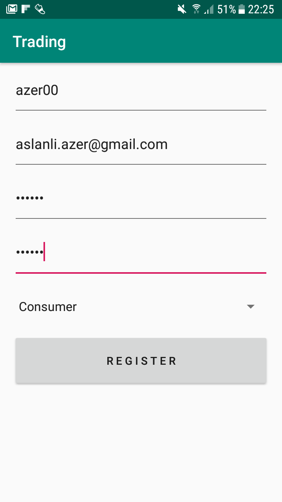
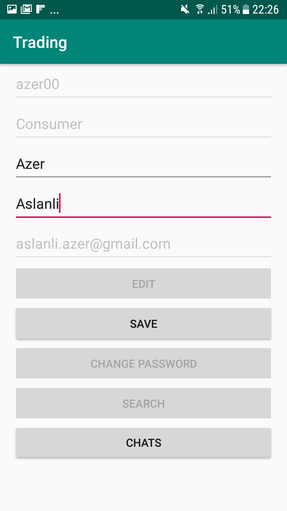
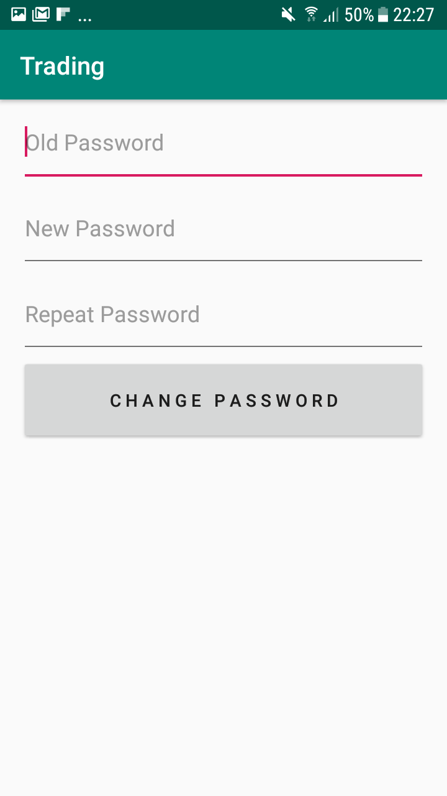
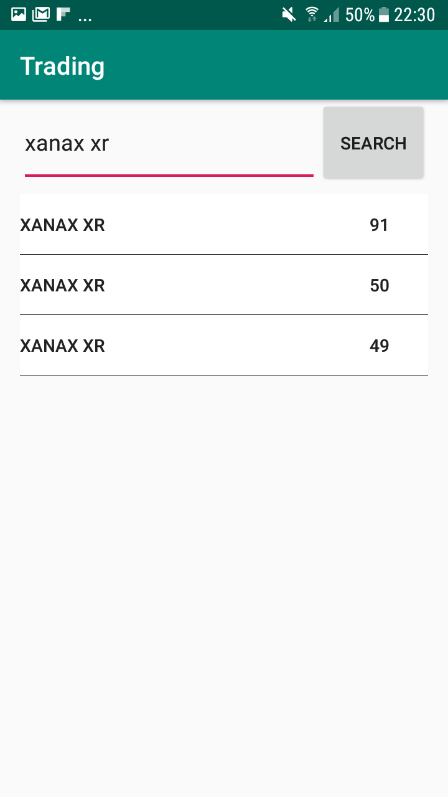
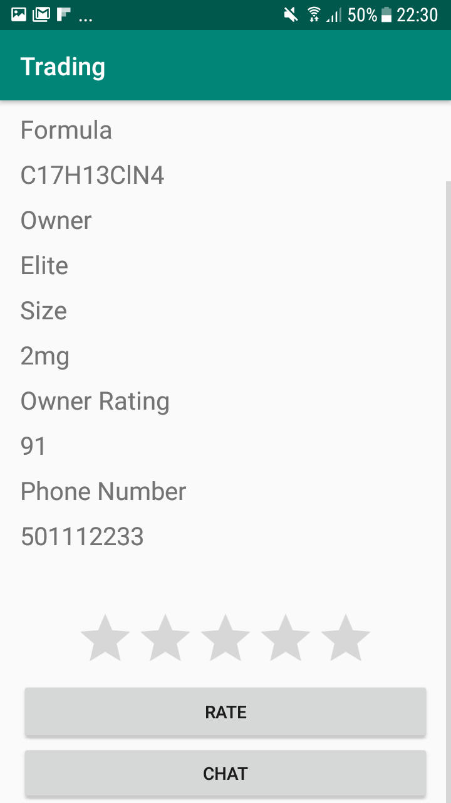
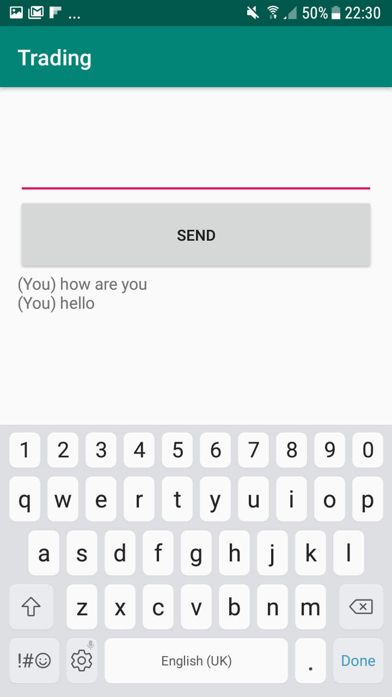

# Medicine_Trading
# Overview
Simple App for trading medicine  
Features: Login, Registration, Private Chat, Search  
IDE: Android Studio.  
Technologies: Java, Ajax, PHP.

<h2>Registration</h2>

<h2>Login</h2>

<h2>Main</h2>

<h2>Change Password</h2>

<h2>Search</h2>

<h2>Product Page</h2>

<h2>Chat</h2>

